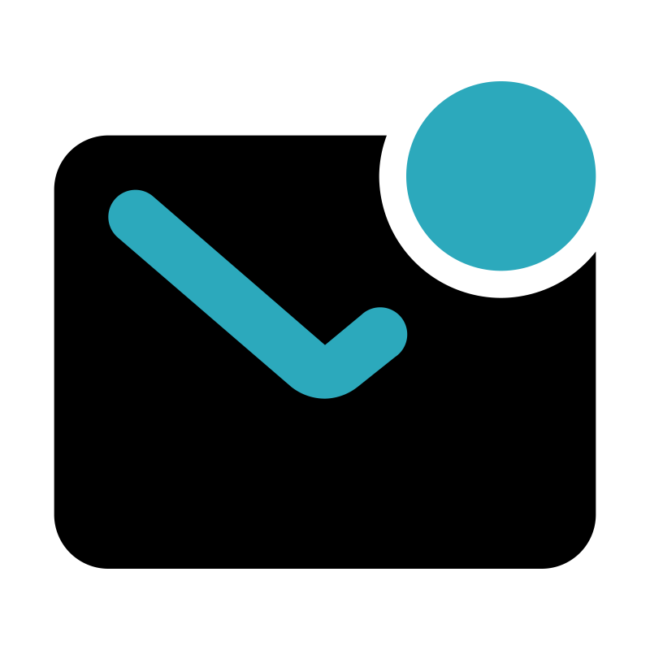

  

<h3 align="center">
Hi there, I'm <a href="https://ideacat.ro/" target="_blank" rel="noreferrer">Răzvan</a>
</h3>

<h2 align="center">
I'm a Full-Stack Web Developer 💻 and DevOps 💭 Enthusiast!
</h2> 

Passionately navigating the realms of Full-Stack Web Development and DevOps, I relish the process of building impactful websites. I enjoy the challenge of unraveling code intricacies and expanding my network in the tech world.

### 🤝 Connect with me:

 
- 💬 If you have any question/feedback, please do not hesitate to reach out to me!

## 🔭 I'm currently working on

- MailDriver (Vue.js & PHP Laravel)
- SMSdriver (Vue.js & PHP Laravel)
- Opensource tools & utilities
- IdeaCat (My current company)
- My devOps skills

## 🌱 I'm currently learning
- Ruby on Rails

## 💼 Technical Skills

 

 

